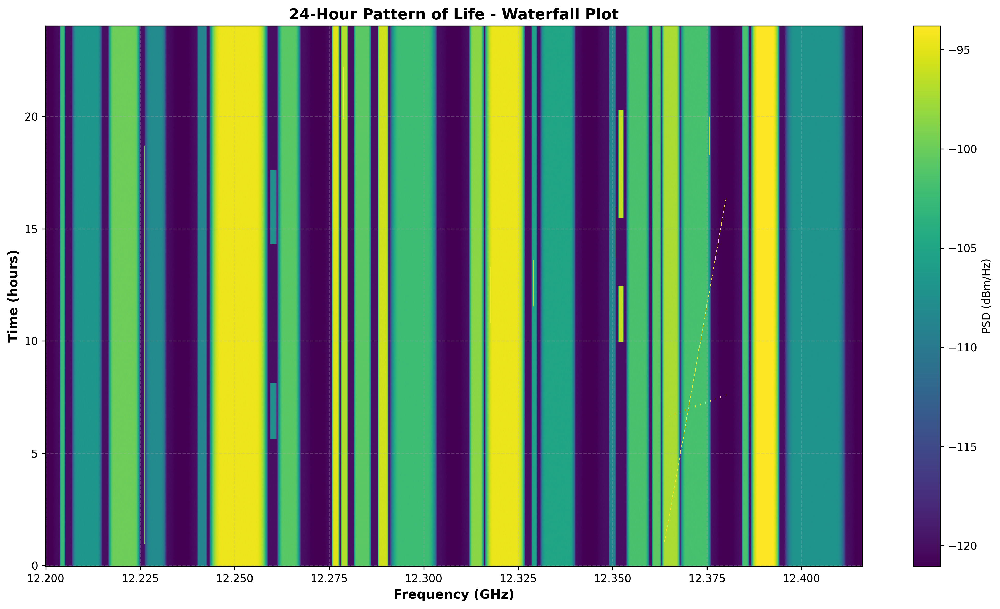

# Satellite Downlink Simulator

A Python library for modeling and simulating satellite communication systems. Build hierarchical representations of satellite downlinks using **Carriers**, **Transponders**, and **Beams**, then generate realistic synthetic Power Spectral Density (PSD) and In-phase/Quadrature (IQ) data for analysis, testing, and visualization.

## Overview

The Satellite Downlink Simulator provides object-oriented abstractions and signal generation capabilities for satellite communications:

### Core Object Model

The library is built around three primary objects that represent the physical architecture of satellite communication systems:

- **Carrier**: Individual communication signals with specific modulation, symbol rate, power level (C/N), and access type (FDMA/TDMA)
- **Transponder**: Satellite transponder channels containing multiple carriers, with defined bandwidth, center frequency, and noise characteristics
- **Beam**: Satellite beam footprints composed of multiple adjacent transponders, representing complete downlink coverage areas

These objects can be composed hierarchically (Beam → Transponders → Carriers) to model realistic satellite communication systems at any level of complexity.



### Signal Generation Capabilities

Two complementary signal generation functions operate on these objects:

- **PSD Generation** (`generate_psd()`): Fast frequency-domain synthesis producing calibrated power spectral density plots. Efficient for visualization and spectrum analysis without time-domain processing overhead.

- **IQ Generation** (`generate_iq()`): Time-domain synthesis producing complex baseband samples with accurate modulation, pulse shaping, and temporal characteristics. Essential for waveform analysis, demodulation testing, and hardware-in-the-loop applications.

Both functions accept Beam or Transponder objects and produce physically accurate outputs matching real-world spectrum analyzer and digitizer measurements.

### Key Features

- **Multiple Modulation Types**: BPSK, QPSK, 16-QAM, 16-APSK, 32-APSK, plus STATIC_CW for unmodulated tones
- **FDMA and TDMA Support**: Full frequency-division and time-division multiple access modeling with burst patterns
- **Physical Accuracy**: RRC pulse shaping, realistic noise modeling, spectrum analyzer RBW/VBW relationships
- **C/N-Based Power Control**: Industry-standard carrier-to-noise specification rather than absolute power
- **Automated Carrier Placement**: Intelligent algorithms for generating non-overlapping multi-carrier scenarios
- **Validation and Constraints**: Built-in checks for bandwidth limits, carrier overlap, parameter consistency
- **Configurable Fidelity**: Adjustable sample rates, resolution bandwidth, and noise characteristics

## Installation

```bash
pip install -e .
```

### Requirements

- Python 3.8+
- numpy
- matplotlib
- attrs

## Quick Start

### Example 1: Single Transponder with FDMA Carriers

```python
from satellite_spectrum_emulator import (
    Carrier, Transponder,
    CarrierType, ModulationType,
    generate_psd, generate_iq
)

# Create carriers
carrier1 = Carrier(
    frequency_offset_hz=-12e6,  # -12 MHz offset
    cn_db=15.0,                 # 15 dB C/N
    symbol_rate_sps=5e6,        # 5 Msps
    modulation=ModulationType.QPSK,
    carrier_type=CarrierType.FDMA,
    rrc_rolloff=0.35,
    name="QPSK Carrier"
)

carrier2 = Carrier(
    frequency_offset_hz=0.0,    # Center frequency
    cn_db=18.0,                 # 18 dB C/N
    symbol_rate_sps=10e6,       # 10 Msps
    modulation=ModulationType.APSK16,
    carrier_type=CarrierType.FDMA,
    name="16APSK Carrier"
)

# Create transponder
transponder = Transponder(
    center_frequency_hz=12.5e9,  # 12.5 GHz
    bandwidth_hz=36e6,           # 36 MHz
    noise_power_density_watts_per_hz=1e-15,
    carriers=[carrier1, carrier2],
    name="Ku-band Transponder"
)

# Generate PSD
frequencies, psd, psd_meta = generate_psd(
    transponder,
    rbw_hz=10e3,    # 10 kHz resolution bandwidth
    vbw_hz=1e3,     # 1 kHz video bandwidth
)

# Generate IQ data
iq_data, iq_meta = generate_iq(
    transponder,
    duration_s=0.001,  # 1 ms
    seed=42
)
```

### Example 2: TDMA Carrier with Bursting

```python
# Create TDMA carrier with burst pattern
tdma_carrier = Carrier(
    frequency_offset_hz=0.0,
    cn_db=20.0,
    symbol_rate_sps=10e6,
    modulation=ModulationType.QPSK,
    carrier_type=CarrierType.TDMA,
    burst_time_s=0.0001,    # 100 us burst duration
    duty_cycle=0.3,          # 30% duty cycle
    name="TDMA Burst"
)

transponder = Transponder(
    center_frequency_hz=14.25e9,
    bandwidth_hz=20e6,
    noise_power_density_watts_per_hz=5e-16,
    carriers=[tdma_carrier]
)

# Frame period is automatically calculated
print(f"Frame period: {tdma_carrier.frame_period_s * 1e6:.1f} us")
print(f"Guard time: {tdma_carrier.guard_time_s * 1e6:.1f} us")
```

### Example 3: Random Carrier Population

```python
import numpy as np

# Create empty transponder
transponder = Transponder(
    center_frequency_hz=12.5e9,
    bandwidth_hz=36e6,
    noise_power_density_watts_per_hz=1e-15,
    name="Auto-populated Transponder"
)

# Automatically populate with random carriers
num_created = transponder.populate_with_random_carriers(
    num_carriers=10,                          # Try to create 10 carriers
    symbol_rate_range_sps=(100e3, 20e6),      # 100 kHz to 20 MHz
    cn_range_db=(6.0, 30.0),                  # 6 to 30 dB C/N
    rrc_rolloff_values=[0.20, 0.25, 0.35],    # Allowed rolloff factors
    seed=42,                                   # For reproducibility
    name_prefix="C"                            # Carrier names: C1, C2, ...
)

print(f"Successfully created {num_created} carriers")
```

### Example 4: Multi-Transponder Beam

```python
from satellite_spectrum_emulator import (
    Beam, Band, Polarization, BeamDirection
)

# Create multiple adjacent transponders
transponders = []
for i in range(6):
    offset = (i - 2.5) * 36e6  # 36 MHz spacing

    transponder = Transponder(
        center_frequency_hz=12.5e9 + offset,
        bandwidth_hz=36e6,
        noise_power_density_watts_per_hz=1e-15,
        name=f"Transponder {i+1}"
    )

    # Populate each with random carriers
    transponder.populate_with_random_carriers(
        num_carriers=np.random.randint(2, 20),
        seed=42 + i
    )

    transponders.append(transponder)

# Create beam
beam = Beam(
    band=Band.KA,
    polarization=Polarization.RHCP,
    direction=BeamDirection.DOWNLINK,
    transponders=transponders,
    name="Asia-Pacific Beam"
)

# Generate beam-wide PSD
frequencies, psd, psd_meta = generate_psd(
    beam,
    rbw_hz=10e3,
    vbw_hz=1e3
)

print(f"Beam center: {beam.center_frequency_hz / 1e9:.3f} GHz")
print(f"Total bandwidth: {beam.total_bandwidth_hz / 1e6:.1f} MHz")
print(f"Total carriers: {beam.total_carriers}")
```

## Core Concepts

### Carrier-to-Noise Ratio (C/N)

Carriers are specified using C/N (dB) instead of absolute power. The actual carrier power is calculated based on the transponder's noise power density:

```
Noise Power (W) = N₀ × Bandwidth
Carrier Power (W) = Noise Power × 10^(C/N_dB / 10)
```

This approach is more intuitive for satellite communications where C/N is the primary metric.

### Resolution Bandwidth (RBW) and Video Bandwidth (VBW)

- **RBW**: Determines the frequency bin spacing in the PSD (smaller RBW = finer frequency resolution)
- **VBW**: Controls the integration/capture time which affects noise variance on the PSD trace

The relationship between VBW and noise:
```
Capture Time ≈ RBW / VBW
Noise Std Dev ∝ √(VBW / RBW)
```

Lower VBW (relative to RBW) results in longer integration time and less noise on the trace.

### Root-Raised-Cosine (RRC) Filtering

All carriers use RRC pulse shaping with configurable rolloff factors (typically 0.20 to 0.35):

```
Occupied Bandwidth = Symbol Rate × (1 + Rolloff)
```

For example, a 10 Msps carrier with 0.35 rolloff occupies 13.5 MHz.

### TDMA Bursting

TDMA carriers burst periodically with specified duty cycles:

```python
carrier = Carrier(
    carrier_type=CarrierType.TDMA,
    burst_time_s=0.0001,    # Burst lasts 100 us
    duty_cycle=0.3,          # Transmitting 30% of the time
    # ... other parameters
)

# Frame period = burst_time / duty_cycle = 333.3 us
# Guard time = frame_period - burst_time = 233.3 us
```

The average power of TDMA carriers is automatically scaled by the duty cycle.

## API Reference

### Carrier

```python
Carrier(
    frequency_offset_hz: float,           # Offset from transponder center (Hz)
    cn_db: float,                         # Carrier-to-noise ratio (dB)
    symbol_rate_sps: float,               # Symbol rate (symbols/second)
    modulation: ModulationType,           # BPSK, QPSK, QAM16, APSK16, APSK32
    carrier_type: CarrierType,            # FDMA or TDMA
    rrc_rolloff: float = 0.35,            # RRC rolloff factor (0 to 1)
    burst_time_s: float = None,           # Required for TDMA
    duty_cycle: float = None,             # Required for TDMA (0 to 1)
    standard: CarrierStandard = None,     # Optional: DVB_S, DVB_S2, etc.
    name: str = None                      # Optional name
)
```

**Properties:**
- `bandwidth_hz`: Occupied bandwidth (symbol_rate × (1 + rrc_rolloff))
- `average_power_watts`: Average power (scaled by duty cycle for TDMA)
- `frame_period_s`: Frame period for TDMA carriers
- `guard_time_s`: Guard time for TDMA carriers

**Methods:**
- `calculate_power_watts(noise_power_density)`: Calculate carrier power from C/N
- `calculate_average_power_watts(noise_power_density)`: Calculate average power (accounts for duty cycle)

### Transponder

```python
Transponder(
    center_frequency_hz: float,                    # Absolute frequency (Hz)
    bandwidth_hz: float,                           # Transponder bandwidth (Hz)
    noise_power_density_watts_per_hz: float,       # Noise floor (W/Hz)
    carriers: List[Carrier] = [],                  # List of carriers
    noise_rolloff: float = 0.25,                   # Transponder edge shaping
    allow_overlap: bool = False,                   # Allow overlapping carriers
    name: str = None                               # Optional name
)
```

**Properties:**
- `total_carrier_power_watts`: Sum of all carrier powers
- `total_noise_power_watts`: Total noise power across bandwidth
- `lower_frequency_hz`: Lower edge frequency
- `upper_frequency_hz`: Upper edge frequency

**Methods:**
- `add_carrier(carrier)`: Add a carrier with validation
- `remove_carrier(carrier)`: Remove a carrier
- `populate_with_random_carriers(...)`: Auto-generate non-overlapping carriers
- `validate_carriers()`: Check all carriers fit and don't overlap

### Beam

```python
Beam(
    band: Band,                           # KU, KA, C, etc.
    polarization: Polarization,           # RHCP, LHCP, VERTICAL, HORIZONTAL
    direction: BeamDirection,             # UPLINK or DOWNLINK
    transponders: List[Transponder] = [], # List of transponders
    name: str = None                      # Optional name
)
```

**Properties:**
- `center_frequency_hz`: Center of the beam
- `total_bandwidth_hz`: Total bandwidth across all transponders
- `total_carriers`: Count of all carriers across all transponders

### Signal Generation

#### `generate_psd()`

Generate Power Spectral Density without full IQ simulation (fast).

```python
frequencies, psd, metadata = generate_psd(
    obj,                        # Beam or Transponder
    rbw_hz,                     # Resolution bandwidth
    vbw_hz=None,                # Video bandwidth (defaults to rbw_hz)
    add_noise=True,             # Add measurement noise
    noise_factor_db=0.5         # Noise std dev in dB
)

# Returns:
# - frequencies: np.ndarray of absolute frequencies (Hz)
# - psd: np.ndarray of PSD values (dBm/Hz)
# - metadata: PSDMetadata object
```

#### `generate_iq()`

Generate time-domain IQ samples with modulation, pulse shaping, and bursting.

```python
iq_data, metadata = generate_iq(
    obj,                        # Beam or Transponder
    duration_s,                 # Duration in seconds
    seed=None                   # Random seed for reproducibility
)

# Returns:
# - iq_data: np.ndarray of complex IQ samples (complex64)
# - metadata: IQMetadata object
```

## Examples

Run the included examples to see all features:

```bash
python main.py
```

This generates five example plots:
1. **example1_fdma_transponder.png**: Multiple FDMA carriers with PSD, IQ, constellation, and spectrogram
2. **example2_tdma_bursting.png**: TDMA burst patterns showing time-domain amplitude and spectrogram
3. **example3_multi_transponder_beam.png**: Six adjacent transponders with randomly placed carriers
4. **example4_overlapping_carriers.png**: Validation of overlapping carrier detection
5. **example5_modulation_comparison.png**: Constellation diagrams for all modulation types

## Algorithm: Random Carrier Placement

The `populate_with_random_carriers()` method uses the following algorithm to place non-overlapping carriers:

1. **Pick random center frequency** (rounded to 100 kHz increments)
   - Must be within usable range (20% margin from transponder edges by default)

2. **Calculate maximum symbol rate** based on distance to edges
   - Ensures carrier bandwidth fits within transponder
   - Accounts for RRC rolloff: `BW = SR × (1 + rolloff)`

3. **Pick random symbol rate** (100 kHz increments) within constraints
   - User-specified range: e.g., (100 kHz, 20 MHz)
   - Must fit within available space

4. **Pick random C/N and modulation** from allowed ranges/types

5. **Attempt to add carrier**
   - Validates carrier fits within transponder bandwidth
   - Validates no overlap with existing carriers (if `allow_overlap=False`)
   - If successful, continue; if fails, retry

6. **Repeat** until target number reached or max iterations exceeded

This algorithm efficiently packs carriers while respecting all constraints.

## Physical Modeling

### Carrier Power Calculation

For each carrier, power is derived from the specified C/N and transponder noise floor:

```python
# Noise power in carrier bandwidth
noise_power = N0 × carrier_bandwidth

# Carrier power from C/N
carrier_power = noise_power × 10^(CN_dB / 10)
```

For TDMA carriers, average power is scaled by duty cycle:
```python
average_power = carrier_power × duty_cycle
```

### PSD Generation

The PSD is generated in the frequency domain without creating full IQ data:

1. Create frequency array based on RBW: `num_points = span / RBW`
2. For each transponder:
   - Add shaped noise floor: `N0 × |H_RRC(f)|²`
   - For each carrier: add shaped carrier PSD: `(P / SR) × |H_RRC(f)|²`
3. Add measurement noise scaled by VBW/RBW ratio
4. Convert to dBm/Hz

### IQ Generation

The IQ generation creates actual time-domain samples:

1. Calculate sample rate: `Fs = 1.25 × bandwidth`
2. For each transponder:
   - Generate and shape broadband noise to match noise floor
   - Frequency shift to transponder center
3. For each carrier:
   - Generate random symbols from constellation
   - Upsample and apply RRC pulse shaping filter
   - Scale to match carrier power
   - Apply TDMA bursting (if applicable)
   - Frequency shift to carrier center
4. Sum all contributions

## Validation

The library includes extensive validation:

- **Carrier bandwidth**: Ensures carriers fit within transponder
- **Overlap detection**: Prevents overlapping carriers (unless explicitly allowed)
- **TDMA parameters**: Validates burst_time and duty_cycle are specified for TDMA carriers
- **FDMA parameters**: Prevents burst parameters on FDMA carriers
- **Positive values**: All frequencies, bandwidths, and rates must be positive
- **Rolloff ranges**: RRC rolloff must be between 0 and 1

## Performance Considerations

- **PSD generation** is very fast (frequency-domain only)
- **IQ generation** is slower (time-domain samples with filtering)
- For large beams (many transponders/carriers), PSD generation is recommended for visualization
- Use shorter durations for IQ when testing (0.001s is usually sufficient)
- Sample rate is automatically set to 1.25× bandwidth

## Technical Details

### Noise Variance and VBW

VBW controls the integration time in a spectrum analyzer, which affects noise variance:

```
Capture Time = RBW / VBW
Noise Variance ∝ 1 / Capture_Time
Noise Std Dev = Base_Noise × √(VBW / RBW)
```

This means:
- VBW = RBW: No noise reduction (minimal integration)
- VBW < RBW: Longer integration, less noise on trace
- VBW > RBW: Shorter integration, more noise on trace

### RRC Filter Normalization

RRC filters are normalized such that:
```
∫ |H(f)|² df = 1 / T = symbol_rate
```

This ensures correct power distribution across the carrier spectrum.

### Modulation Types

Supported modulation schemes with typical applications:

- **BPSK**: Basic telemetry, low data rate links (2 states)
- **QPSK**: DVB-S, standard satellite communications (4 states)
- **16-QAM**: High throughput data, requires better C/N (16 states)
- **16-APSK**: DVB-S2, more robust than 16-QAM (16 states)
- **32-APSK**: DVB-S2, high spectral efficiency (32 states)

## Project Structure

```
satellite_downlink_simulator/
├── satellite_downlink_simulator/
│   ├── __init__.py          # Top-level exports (backward compatibility)
│   ├── objects/             # Object model definitions
│   │   ├── __init__.py
│   │   ├── carrier.py       # Carrier class
│   │   ├── transponder.py   # Transponder class
│   │   ├── beam.py          # Beam class
│   │   ├── metadata.py      # Metadata classes for PSD/IQ
│   │   └── enums.py         # Enumerations (Band, Polarization, ModulationType, etc.)
│   ├── simulation/          # Signal generation functions
│   │   ├── __init__.py
│   │   ├── psd.py           # PSD generation (frequency domain)
│   │   └── iq.py            # IQ generation (time domain)
│   └── utils.py             # Signal processing utilities (RRC, constellations, validation)
├── apps/                    # Example applications
│   └── rf_pattern_of_life_example/  # 24-hour temporal simulation example
├── main.py                  # Basic examples and test cases
├── setup.py                 # Package configuration
└── README.md                # This file
```

## Dependencies

- `numpy >= 1.20.0`: Numerical computations
- `attrs >= 21.0.0`: Class definitions
- `matplotlib >= 3.3.0`: Plotting (for examples)

## License

MIT License - see LICENSE file for details

## Contributing

Contributions welcome! Please submit issues and pull requests on GitHub.

## Author

Created for satellite communications simulation and analysis.

## References

- DVB-S2 Standard (ETSI EN 302 307)
- IESS-308: Intelsat Earth Station Standards
- Root-Raised-Cosine Filter Theory
- Spectrum Analyzer RBW/VBW Relationships
